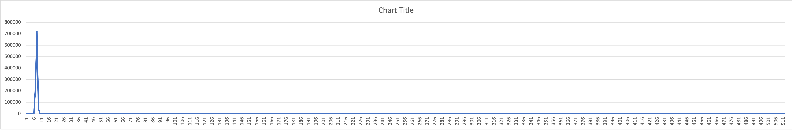
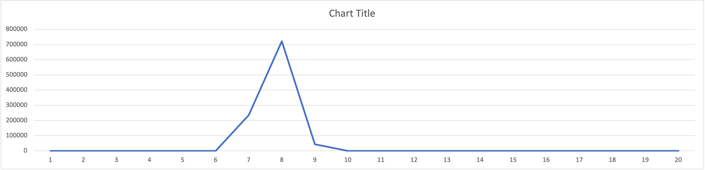

# hist - fast histogramner

This histogrammer was developed to analyze software timings.
But it could be used for almost anything.

# Table of contents

<sup>(table of contents from https://luciopaiva.com/markdown-toc/)</sup>

## COPYRIGHT AND LICENSE

I want there to be NO barriers to using this code, so I am releasing it to the public domain.
But "public domain" does not have an internationally agreed-upon definition, so I use CC0:

Copyright 2022 Steven Ford http://geeky-boy.com and licensed
"public domain" style under
[CC0](http://creativecommons.org/publicdomain/zero/1.0/):


To the extent possible under law, the contributors to this project have
waived all copyright and related or neighboring rights to this work.
In other words, you can use this code for any purpose without any
restrictions.  This work is published from: United States.  The project home
is https://github.com/fordsfords/hist

To contact me, Steve Ford, project owner, you can find my email address
at http://geeky-boy.com.  Can't see it?  Keep looking.

## REPOSITORY

See https://github.com/fordsfords/hist for code and documentation.

## DEPENDENCIES

The core module (hist.c) does not depend on other modules.

However, the "hist_test.c" example program depends on:
* https://github.com/fordsfords/rdtsc - for high-resolution timestamps.

## INTRODUCTION

I wrote this simple histogrammer to analyze software timings.
But there isn't anything in the code that assumes the recorded values are times.
It just records the frequencies of 64-bit unsigned integers.

I usually write the output to a CSV file and plot it using Excel.
Seeing the histogram visually is a powerful tool for understanding.

It does *not* keep a list of every individual value,
it only keeps track of the bucket counts.
Thus, it can't report the median value, only the mean.
This is fine for my purposes - the median is most useful when you don't want
outliers to have an undue influence on the results.
For my purposes, outliers are very important;
we *want* the outliers to influence.

A primary goal of this module is to minimize the execution time of adding
values to the histogram.
So the input values are not processed in any way.
For example, it is the caller's responsibility to bucketize the values.
The "hist_input()" function expects an input value between 0 and the (size - 1)
of the histogram.
Values at "size" and above are counted, and contribute to the average,
but are not bucketed.

## USAGE

The hist.c module contains a structure and four API functions
(from hist.h):
````C
struct hist_s {
  uint64_t *buckets;
  uint64_t min_raw;
  uint64_t max_raw;
  uint64_t sample_sum;
  int size;  /* Number of buckets. */
  int overflows;  /* Number of values above the last bucket. */
  int num_samples;
};
typedef struct hist_s hist_t;

hist_t *hist_create(int size);
void hist_init(hist_t *hist);  /* Clear a histogram. */
void hist_input(hist_t *hist, uint64_t raw_sample, int bucket);
void hist_print(hist_t *hist);  /* Print to stdout the buckets. */
void hist_delete(hist_t *hist);
````

The hist_input() function deserves a more detailed description.
With most applications of a histogrammer, the data values being
histogrammed need to be "bucketed".

For example,
if timing a function that takes between 2000 and 100,000 nanoseconds,
it may not be practical to make your histogram size 100,000 buckets.
Instead, you might want to have a 100-bucket histogram with each bucket
representing 1000 nanoseconds:
````C
  hist_input(hist, funct_time_ns, funct_time_ns/1000);
````
The "funct_time_ns/1000" calculates the bucket number.

The min, max, and sum are based on the non-bucketed "raw" values.

## TEST PROGRAM

The "hist_test.c" program is intended to demonstrate its use,
and measure the cost of using it.
It uses the [rdtsc](https://github.com/fordsfords/rdtsc) module to get
a high-resolution timestamp.
But note that rdtsc returns a "tick" count, not a normalized time stamp.
Thus, the tick count does not necessarily represent any specific time.

Here's a fragment of hist_test.c:
````C
  for (i = 0; i < 1000000; i++) {
    uint64_t rdtsc1, rdtsc2;
    RDTSC(rdtsc1);
    RDTSC(rdtsc2);

    hist_input(hist, (rdtsc2 - rdtsc1), (rdtsc2 - rdtsc1) / 4);
  }
````
The choice here was to minimize the overhead of the measurement code,
so the bucketing simply takes the tick count and divides it by 4.
This gets rid of the quantization errors of rdtsc.
But the min, max, and average are calculated on the raw tick counts,
which can be converted to nanoseconds using "rdtsc_ticks_per_sec".

## RESULTS

I ran the example program as follows:
````
$ ./hist_test >hist.out
$ head -11 hist.out
avg hist=6.661951 ns, avg 2 ticks+hist=17.199077, ticks per sec=2792957961
histogram of 2 rdtsc: min=6.444780 ns, max=3044.084486 ns, avg=10.178819 ns, ovf=4, ns per bucket=1.432173
0
0
0
0
8
25
235524
721415
43023
````

In this test run, the peak is in bucket 8 with a count of 721415
(see (hist.csv)[hist.csv]).
Each bucket represents 4 ticks, which means that 721415 measurements were
between 28 and 31 ticks.
On this machine, 4 ticks take 1.432 nanoseconds,
so bucket 8 represents 10.025 .. 11.457 nanoseconds.
This agrees with the calculated average of 10.178819 ns.

On my Mac (which has MS Excel installed):
````
$ sed <hist.out >hist.csv '1,2d'  # delete first 2 lines
$ open hist.csv
````

Then in Excel I plotted the histogram (select column A, "insert",
"chart", "line"):



Here's plotting the first 20 buckets:


